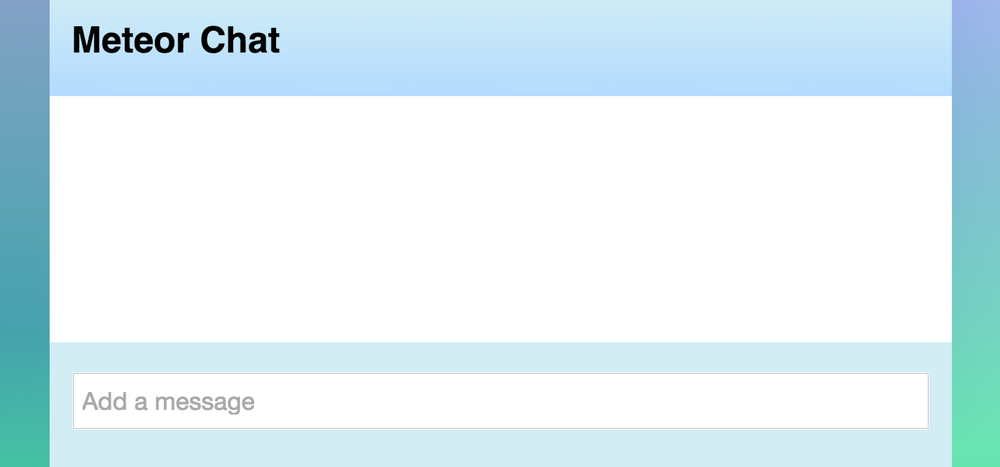

{{#template name="simple-chat-step01"}}

# Meet Meteor: Build a chat app in <100 lines of JavaScript - Part One

In this tutorial, we will explore the core features of Meteor by building a functional chat application with very little code. 

## Install Meteor and create a project
You can install Meteor in a couple of minutes. Installation details for Windows, OS X, and Linux are on our [install page](https://www.meteor.com/install).

Now you have the Meteor CLI tool are ready to create a project. Run these commands in the terminal:

```bash
    meteor create chat # => chat created. To run...
    cd chat
    meteor remove insecure # => insecure  removed from your project
    meteor remove autopublish # => autopublish  removed from your project
```
    
This has scaffolded a small app called `chat`.  We also removed a couple of packages, `insecure` and `autopublish`. These packages are designed to make prototyping simpler, but we won't use them here.

Now, in the terminal (while still in the `chat/` directory), type:

```
meteor
```

 This tells Meteor to run your app on a development server. As Meteor will tell you in the output, you can view the app by opening your browser to [localhost:3000](http://localhost:3000). You can try clicking the button in the app.

Let's replace the code in this app (you can leave the server running). Open the chat directory in your code editor. You will see the app is constructed of 3 files: chat.html, chat.js, and chat.css. 

* Delete all the code in chat.html, chat.js, and chat.css so that they are all empty files.

## Add the CSS

Let's go ahead and paste in some css code so the app will look good (we'll ignore the css from here on):

* Copy the CSS from [here](https://github.com/rdickert/chat-tutorial-code/blob/master/chat1.css), paste it into chat.css, and save.

## Structure the HTML
Now add the following to chat.html (make sure you keep comments, enclosed in `<!--  -->` in html – we'll use those as markers to add more code later):

```html
<head>
  <title>Meteor Chat</title>
</head>

<body>
  <div class="container">
    <header>
      <h1>Meteor Chat</h1>
    </header>
    <!-- chat messages here -->
    <!-- more-messages button -->
    <footer>
        <form class="new-message">
          <input type="text" name="text" placeholder="Add a message" autocomplete="off"/>
        </form>
    </footer>
  </div>
</body>

<!-- message template here -->
```

We now have a skeleton. If everything went well, you should see an empty chat app: 



## Hot code push

You may have noticed that when you hit save, the browser updated without restarting the server. This Meteor feature is called **hot code push**. When Meteor detects a file change, it rebuilds your app and pushes it to all connected clients. 

Go ahead and try changing the name or some of the styling of the app. This facilitates a very interactive kind of development. This is possible with some other frameworks by using a tool like LiveReload, but with Meteor, it comes built-in.

Not only is hot code push great for development, but it also  works in production, allowing you to push updates to connected users live – and Meteor has a mechanism for preserving their state so they don't lose their place in the app. This is a great example of how the Meteor platform looks at the entire development and deployment process, not just code framework features.

## Conclusion: Ready to rock

We've installed Meteor and scaffolded our chat app. Notice how little effort this took. Because Meteor has simple installation, easy app creation, an included development server, and hot code push, we are already focusing on our app rather than spending time installing Node.js, MongoDB, a templating system, or other components. In [the next step](chat-tutorial-part-2.md), we'll complete the main functionality of the app: rendering messages to all connected clients.
{{/template}}


