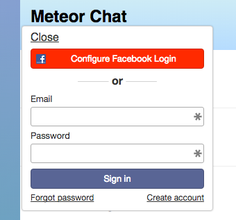

# Meet Meteor Part Three: User Accounts
 
 This is part 3 of a 5 part series:

1. [Install Meteor and create your app](chat-tutorial-part-1.md)
2. [Implement basic chat](chat-tutorial-part-2.md)
3. Add user accounts
4. [Refine the UI of the app](chat-tutorial-part-4.md)
5. [Deploy the app and create a mobile version](chat-tutorial-part-5.md)

## Adding accounts

We have a working chat mechanism, thanks to Meteor's built-in websocket support, full-stack database driver, and reactive rendering. But chat requires user accounts so we can identify who's talking. Many frameworks would require a full tutorial just on this topic, and if we want to add OAuth login via Facebook, Google, etc, that can be a week's project. Let's see if we can do a little better than that.

To add front- and back-end accounts functionality, go to your `chat/` directory and type the following:

```bash
meteor add accounts-ui 
meteor add accounts-password 
meteor add accounts-facebook
# or you can type meteor add accounts-ui accounts-password accounts-facebook on one line
```

The packages you just added using the Meteor tool provide a complete end-to-end accounts system:

* `accounts-ui` provides front-end UI elements for account management. It automatically includes another package, `accounts-base`, that adds core client and server infrastructure. In other apps, you might choose to build your own UI on the base accounts functionality, or perhaps to use a different UI package that is themed with CSS framework like Bootstrap, Ionic, or Semantic UI. [You can see some of these options on Atmosphere,](https://atmospherejs.com/meteor/accounts-ui?q=accounts) Meteor's package package repository.
* `accounts-password` provides functionality for pure username/password accounts that are stored on your server. 
* `accounts-facebook` provides OAuth functionality for Facebook. There are several other OAuth sites supported (including Github, Google, Twitter, and Weibo), and you can also extend it yourself.

## Add a login widget

We'll need some UI so we can log in to the app. Meteor's accounts system provides a simple widget we can include with `{{> loginButtons}}`. Add that one-liner right after the h1 tag in the header:

```html
    <header>
      <h1>Meteor Chat</h1>
      {{> loginButtons}}
    </header>
```

When you hit save, you'll see the widget. You can click on it to expand it. 



There's our Facebook button in red. If you click on it, you'll see that it does a one-time configuration. Once you enter the required information from your Facebook developer account, anyone with a Facebook account will be able to log in. Adding OAuth in other frameworks can be a week's work, but here we did it in few minutes.

We'll stick with simple password-based authentication for the rest of this tutorial. 

## Configure accounts

If you look at the login widget, it asks for the user's email address. For us it would be simpler to have them choose a username. Let's add configuration under the line `/*account config*/` in chat-demo.js.

```javascript
  /*account config*/
  Accounts.ui.config({
    passwordSignupFields: "USERNAME_ONLY"
  });
```

When you hit save with the widget open, you'll see hot code push in action, changing from an email login to a username-based one. Note how the widget stayed open, maintaining the state of the app even though we swapped out the underlying code. Don't log in just yet.

## Secure the app and track the username

Next, let's update our method. Let's add the username to the message, and let's disable adding messages if you are not logged in. You'll need to add these lines under `/* add authentication here */`

```javascript
    if (! Meteor.userId()) {
      throw new Meteor.Error("not-authorized");
    }
```

Then change `username: "anonymous"` to return the username through the accounts system. Your final method code will look like this:

```javascript
Meteor.methods({
  sendMessage: function (message) {
    if (! Meteor.userId()) {
      throw new Meteor.Error("not-authorized");
    }

    Messages.insert({
      messageText: message,
      createdAt: new Date(),
      username: Meteor.user().username  // <-add real username
    });
  }
});
```

## Hide the messages form when logged out

You have now secured your method. Try putting in new messages from the app and from the browser console. If the console is open, you will see the "not authorized" error. This is the behavior we want, but there is a UX problem: Showing the message input field to an unauthenticated user is bad because it will silently fail when they try to use it. It would be better to hide the input. Let's do that. Go back to the HTML. The accounts package gives us access to another helper called `{{currentUser}}` which will return their account ID if they are logged in but will be undefined if not. We can use this to our advantage by wrapping the input form in an `#if` helper. Update your `footer` element with the `#if`/`/if` helper pair so it looks like this:

```javascript
    <footer>
      {{#if currentUser}}
        <form class="new-message">
          <input type="text" name="text" placeholder="Add a message" autocomplete="off" />
        </form>
      {{/if}}
    </footer>
```

When you hit save (if you are still logged out), the input field should be gone. Now create an account using the widget. The input field reappears reactively. We didn't have to write code to show/hide, add classes, or otherwise manipulate the DOM. We just declaratively told Meteor how to render the view, and Meteor changed the underlying DOM for us.

Now that you are logged in, add a message. If everything is correct, you will see your message logged with the correct username. Logging out should cause the input to disappear as well.

##Conclusion: This is a real chat app

Our app now handles user authentication and controls who can add messages. It is secured against anonymous use, and the interface updates reactively based on the login status of the user. With a few packages, we got integrated accounts behaviors for the server and the client, including Oauth integration, and we even got a visual component, the login widget, for free. This is what a full-stack package system can do. There are other [account UIs available on Atmosphere](https://atmospherejs.com/?q=account%20ui) to give you more control of the look and feel of your app, or you can create your own.

We could stop here, but let's go a little deeper into the UI. It's great that we got something very rudimentary, but how does Meteor handle more subtle UI interactions? The [fourth installment](chat-tutorial-part-4.md) of this series will take you into slightly more advanced UI work. 
