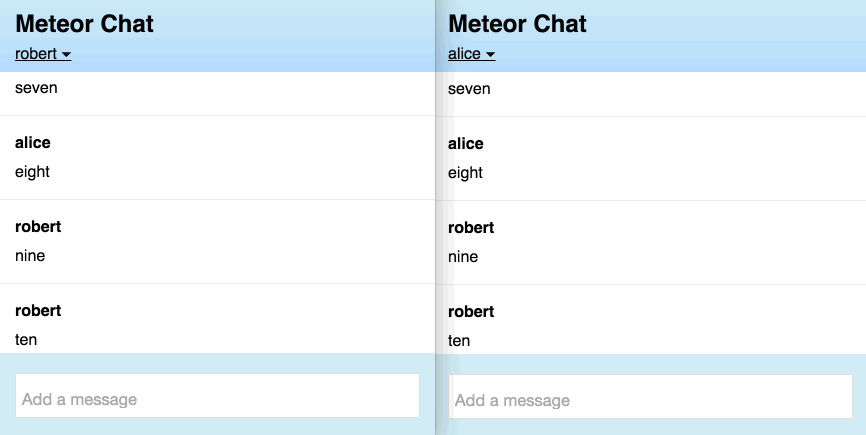

# Meet Meteor Part Four: Better UI

This is part 4 of a 5 part series:

1. [Install Meteor and create your app](chat-tutorial-part-1.md)
2. [Implement basic chat](chat-tutorial-part-2.md)
3. [Add user accounts](chat-tutorial-part-3.md)
4. Refine the UI of the app
5. [Deploy the app and create a mobile version](chat-tutorial-part-5.md)

## UX Issues
We've gotten an amazingly long way with in our chat app with a small amount of code. We have used Meteor's core reactivity and database synchronization features to render messages in real-time to all clients, and we've used Meteor's accounts system to keep track of users with very little effort. We've definitely cheated on the chat window rendering, though. Right now, only 5 chats are stored locally at all. After that number, when another message is added, the oldest one is deleted from the client cache, even though those messages still exist on the server. While this is a great demonstration of how the client cache can be a subset of the master database, a real chat app should allow you to scroll through old messages. This brings with it some UI complexity, however. In addressing these, we will learn about reactive variables and see a couple of more advanced hooks that allow us to trigger actions at key moments in an app's lifecycle. This will allow us to explore what it takes to move a small bit of functionality out of the "toy" phase to behave in a way that is sophisticated enough to satisfy real users.

## View the message history
Let's go ahead and remove the limit on the amount of messages synced to the client. Let's simplify the `publish` function (in the `if (Meteor.isServer)` code block) to return all messages:

```
  Meteor.publish("messages", function () {
    return Messages.find();
  });
```

## Make a scrollToBottom() function
Once you've done this, it becomes obvious why we were cheating: The message window shows the top of the list, which shows the oldest messages. You have to scroll down to see the latest. Not only that, but if you add a new message, you'll have to scroll to see that one too. We can solve this by adding a function to scroll the window to the bottom any time a message is rendered. 

First, let's make a function that will scroll the window to the bottom using jQuery. We will also add a boolean called `autoScrollingIsActive` which we will use later. You can add this just below the publish code, replacing `/* scrolling code */` as shown:

```javascript
if (Meteor.isServer) {
  // This code only runs on the server
  Meteor.publish("messages", function () {
    return Messages.find();
  });
}

var autoScrollingIsActive = false;
/* reactive var here */
scrollToBottom = function scrollToBottom (duration) {
  var messageWindow = $(".message-window");
  var scrollHeight = messageWindow.prop("scrollHeight");
  messageWindow.stop().animate({scrollTop: scrollHeight}, duration || 0);
};
```

You can play with this function in the browser console. With the window scrolled away from the bottom (add messages if you need to), try `scrollToBottom()` to change it instantly or `scrollToBottom(500)` to see it scroll smoothly. The `.stop()` in the jQuery will reset the animation if it's called multiple times so that it doesn't cause scrolling problems.

## Trigger auto-scrolling on startup 
So we have the tool we need. Let's make it so the app will be scrolled correctly when you first open it. Meteor provides a callback to `subscribe` called `onReady` that allows us to call a function when all the data is received from the server. Let's use that to snap the message window to the bottom (we don't want an animation here). We'll also set `autoScrollingIsActive` to true – again, we'll use that shortly. Replace `Meteor.subscribe("messages");` so it looks like the following (a few surrounding lines are shown):

```javascript
if (Meteor.isClient) {
  // This code only runs on the client
  Meteor.subscribe("messages", {
    onReady: function () {
      scrollToBottom();
      autoScrollingIsActive = true;
    }
  });

  Template.body.helpers({
```

## Trigger auto-scrolling when a message arrives
So now we need to trigger `scrollToBottom()` when new messages come in. Meteor provides the `onRendered()` hook to execute code whenever a template has been placed into the DOM - which will happen whenever a new message is added. Let's use that to call `scrollToBottom()`.  Replace `/*chat window scrolling*/` with:

```javascript
  Template.message.onRendered(function () {
    if (autoScrollingIsActive) {
      scrollToBottom(250);
    } 
  });
```

We do this only `if (autoScrollingIsActive)` so that it doesn't scroll on the initial page load but only when new messages come in. And this seems to solve our problem. It will advance all client chat windows when new messages come in. It also adds an animation that is both pleasant and provides continuity when new chats roll in. 

## Allowing the user to view history
Consider, though, why we put in the scrollable window in the first place. The whole point is to be able to look at the message history. What if you are reading something from a while ago and someone else posts a new message? Sorry, you are forcibly scrolled back to current messages. This will anger users. You can test this by opening a second window in incognito mode or using a different browser to log in as a second user (otherwise both windows will always be the same user, and you won't be able to test our new features). See how a message from one user forces the other user to the most recent message.

It turns out that the rules we need are a little more involved than it first seemed:

1. When we are at the bottom, we want the chat window to advance automatically.
2. When we are viewing the chat history (not at the bottom), we want the chat window to do nothing when a new message comes in.
3. If we scroll back to the bottom, though, the app should again advance automatically.

It would seem that we need some kind of way to detect that we are at the bottom to turn automatic scrolling on or off. It turns out that we can do that by watching scroll events on our chat window. Place this event handler under `/* scroll event */`

```javascript
    "scroll .message-window": function () {
      var howClose = 80;  // # pixels leeway to be considered "at Bottom"
      var messageWindow = $(".message-window");
      var scrollHeight = messageWindow.prop("scrollHeight");
      var scrollBottom = messageWindow.prop("scrollTop") + messageWindow.height();
      var atBottom = scrollBottom > (scrollHeight - howClose);
      autoScrollingIsActive = atBottom ? true : false;
    },
```

This code uses jQuery to calculate how close to the bottom we are, and  `autoScrollingIsActive` will be set to true/false depending of whether we are within 80 pixels of the bottom.

Great, now we have reasonable scrolling behavior. `autoScrollingIsActive` will become active any time we scroll close enough to the bottom, and it will turn off when we scroll away. Give it a try.

One more thing: The window should scroll down any time you post a message yourself, even if you are currently viewing your history. Let's fix that quickly by adding a single call to `scrollToBottom()` in the `submit` event handler:

```javascript
    "submit .new-message": function(event) {
      var messageText = event.target.text.value;

      Meteor.call("sendMessage", messageText);
      scrollToBottom(250); // <--add this line

      event.target.text.value = "";
      event.preventDefault();
    },
```
This is starting to work much better.


## Notifying users when a message comes in

There is one other UX problem when you are looking at the chat history: There is no way to tell that new messages have arrived, so you may miss important messages.

Let's implement a "new messages" button that will appear only when you are in the chat history and have a new message come in. It should have the following behaviors:

1. It appears when you are in your chat history (not at the bottom) and a new message comes in.
2. It should scroll the window to the bottom and disappear when you click it.
3. It should go away on its own if you scroll to the bottom yourself.

## Store local state in a reactive variable

To implement this, we'll use a reactive variable from the `reactive-var` package. A reactive variable is an object with `.get()` and `.set()` methods that is able to drive reactive change in the UI when it changes. Unlike database collections, each browser window gets its own copy of the reactive variable, so state will not be transmitted between clients or even between tabs in the same browser. Let's build the button and see how this works. We'll also make the button fade in and out for a nice effect. To do the fading, we'll add an animation package called Momentum. In the terminal in your `chat/` directory:

```bash
meteor add reactive-var
meteor add percolate:momentum
```

This will give you the helpers we'll use in the HTML to fade the button in and out. Let's add the button with helpers now in the HTML file by replacing the `<!-- more-messages button -->` comment with:

```html
    {{#momentum plugin="fade"}}
      {{#if thereAreUnreadMessages}}
        <button class="more-messages">New Messages &#x25BE;</button>
      {{/if}}
    {{/momentum}}
```

In the JavaScript, let's create a reactive variable to store this the state of this button. Replace `/* reactive var here */` with:

```javascript
thereAreUnreadMessages = new ReactiveVar(false);
```

We temporarily made `thereAreUnreadMessages` a global (no `var` at the beginning) so you can access it from the console – you can add a `var` later, if you want. 

We need to expose our reactive variable with the helper function `thereAreUnreadMessages`. Replace `/* unread message helper */` with:

```javascript
    thereAreUnreadMessages: function () {
      return thereAreUnreadMessages.get();
    }
```

(Make sure the `recentMessages` helper function body (above the new helper) has a comma at the end so you don't get an error.)

Go to the browser console and type:

```
thereAreUnreadMessages.set(true)
```

Look, the button fades in! You can remove it with `thereAreUnreadMessages.set(false)`. This is another example of reactive rendering: You simply declaratively state that the button should be present if the variable is true, and Meteor will rerender the DOM as necessary when that variable changes. 

## Implement the button's behaviors
First, let's make the button appear at the appropriate time. The time to check is when a new message comes in, which will trigger the `onRendered()` callback we already have. If autoscrolling is not active, we are in message history and might have unread messages. To prevent unwanted appearances of the button we should also make sure that the user is logged in and the the new message wasn't written by the user but by someone else. Replace the `onRendered` block with the following:

```javascript
  Template.message.onRendered(function () {
    if (autoScrollingIsActive) {
      scrollToBottom(250);
    } else {
      if (Meteor.user() && this.data.username !== Meteor.user().username) {
        thereAreUnreadMessages.set(true);
      }
    }
  });
```

The button should go away if we scroll to the bottom by ourselves. This is easily done by setting `thereAreUnreadMessages` to false if we are at the bottom. Add lines to the `scroll` event to make it match the following: 

```javascript
    "scroll .message-window": function () {
      var howClose = 80;  // # pixels leeway to be considered "at Bottom"
      var messageWindow = $(".message-window");
      var scrollHeight = messageWindow.prop("scrollHeight");
      var scrollBottom = messageWindow.prop("scrollTop") + messageWindow.height();
      var atBottom = scrollBottom > (scrollHeight - howClose);
      autoScrollingIsActive = atBottom ? true : false;
      if (atBottom) {        // <--new
        thereAreUnreadMessages.set(false);
      }
    },
```


## Make the button a button
Making the button actually scroll the window is very simple. Just add this event directly under the `scroll event`:

```javascript
    "click .more-messages": function () {
      scrollToBottom(500);
      thereAreUnreadMessages.set(false);
    }
```


## Conclusion: This feels like a real chat app
Try out the app now, again with two users. The button will appear when we are in history and a new message from another user comes in. If we press it, we will be scrolled to the bottom and it will fade out. If we scroll to the bottom ourselves, it will go away on its own. Nice!



It turned out that chat scrolling behavior is quite rich. We were able to make the app handle users' UX needs quite easily by using the `onRendered()` hook, some jQuery, a reactive variable, and an animation package. This represents some typical tasks you might have to work through to make a great UI.

Although we only have one chat room, this is otherwise a pretty functional chat app – and we still have less than 100 lines of JavaScript. You have experienced most of the major phases of building a Meteor app. All that's left is to deploy it. We'll cover that as well as mobile integration in [the final installment](chat-tutorial-part-5.md) of this tutorial.